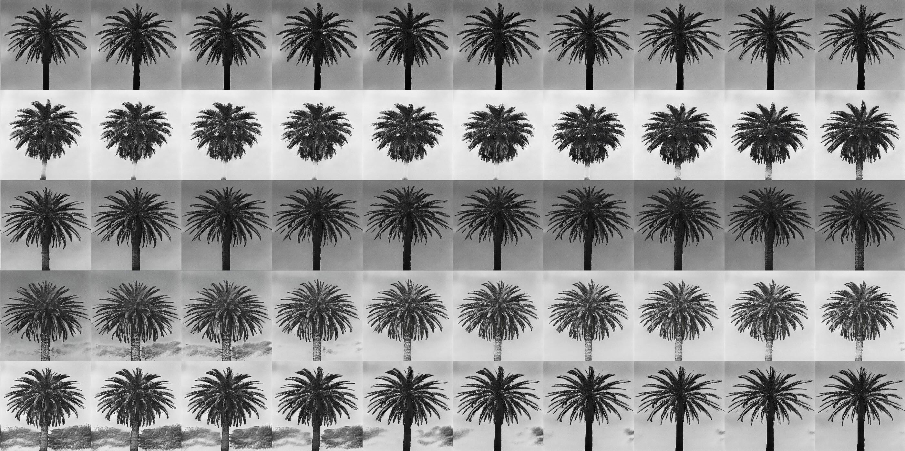

[//]: <> (https://www.asciiart.eu/image-to-ascii, use gradient 2)

## Hi there!!

I'm a cell biologist with a background in computer science, developing [real-time feedback control microscopy](#research) approaches at the University of Bern.

## Research
### Smart microscopy
During my PhD in [Pertz Lab](https://www.pertzlab.net) I built an experimental platform for closed-loop, feedback control microscopy. We primarily use the platform for optogenetic experiments, where we segment and track cells in real-time to automatically generate stimulation masks with sub-cellular precision. This technology allows us to manipulate cells with remarkable accuracy, and for example steer them around like tiny biologcial remote-controlled cars. We can control hundreds of cells simultaneously, enabling unprecedented experimental throughput.

<figure>
<pre>
╭──────────────────────────────╮
│ User                         │
╰──────────────────────────────╯
    ↕          ↕          ↕
┌────────┐ ┌────────┐ ┌────────┐
│ GUI    │ │ CODE   │ │ LLM    │
│ napari │ │ python │ │        │
└───┬────┘ └───┬────┘ └───┬────┘
┌───┴──────────┴──────────┴────┐
│ Microscope Control Software  │
│ uManager/pymmcore            │
└──────────────┬───────────────┘
┌──────────────┴───────────────┐
│ Microscope Hardware          │
│ camera/stage/filters/DMD/... │
└──────────────────────────────┘
               ↕
╭──────────────────────────────╮
│ Live Cells                   │
│ biosensors/optogenetics      │
╰──────────────────────────────╯
</pre>
<figcaption>Figure: Architecture of feed-back control microscopy platform.</figcaption>
</figure>

A current project explores how LLMs can interface between users and microscope hardware, to simplify the control of these complex machines and enable complex automation tasks that require reasoning on experimental output. 

As member of the [Smart Microscopy Working Group](https://smartmicroscopy.github.io), I am interested to standardize adaptive feedback microscopy workflows, working with experts from academia and industry to create reference specifications for consistent implementation and reproducibility across imaging systems.

### Image analysis
Passionate about all things bio-image analysis, I’m especially proud of **[Convpaint](https://github.com/guiwitz/napari-convpaint)**, an interactive pixel classification tool we developed. It uses pretrained ViTs to extract image features. With a simple GUI in napari, users can train an ML model in seconds to identify structures in cells and tissues, or even track animal behavior. Convpaint seamlessly handles multidimensional data (time-series, 3D, multichannel).

### Cellular signalling
Using diverse experimental approaches (fluorescent biosensors, optogenetics, micro-fabrication), I’m investigating cellular signaling dynamics, primarily at the subcellular scale. I’m fascinated by self-organizational properties at the interface between active matter and life.

## Publications
<table>
<thead>
  <tr>
    <th class="width-min">Year</th>
    <th class="width-auto">Title</th>
    <th class="width-min">Link</th>
  </tr>
</thead>
<tbody>
  <tr>
    <td>2024 1st</td>
    <td>Convpaint - Universal framework for interactive pixel classification using pretrained neural networks 
    _L Hinderling, G Witz, R Schwob, A Stojiljkovic, M Dobrzyński, M Vladymyrov, J Frei, B Grädel, A Frismantiene, O Pertz_</td>
    <td>[bioRxiv]()</td>
  </tr>
  <tr>
    <td>2024</td>
    <td>Feedback regulation by the RhoA-specific GEF ARHGEF17 regulates actomyosin network disassembly 
    _V Rao, B Gradel, L Hinderling, J van Unen,  O Pertz_</td>
    <td>[bioRxiv](https://www.biorxiv.org/content/10.1101/2024.08.28.610052v1)</td>
  </tr>
  <tr>
    <td>2024</td>
    <td>Transformer-based spatial–temporal detection of apoptotic cell death in live-cell imaging 
    _AP Gagliardi, DU Pizzagalli, PA Gagliardi, L Hinderling, P Lopez, R Zayats, PC Barberà, P Antonello, MP Segura, B Grädel, M Nicolai, A Giusti, M Thelen, LM Gambardella, TT Murooka, O Pertz, R Krause, SF Gonzalez_</td>
    <td>[elife](https://elifesciences.org/articles/90502)</td>
  </tr>
    <tr>
    <td>2023</td>
    <td>Automatic detection of spatio-temporal signaling patterns in cell collectives 
    _PA Gagliardi, B Grädel, MA Jacques, L Hinderling, P Ender, AR Cohen, G Kastberger, O Pertz, M Dobrzyński_</td>
    <td>[JCB](https://www.ncbi.nlm.nih.gov/pmc/articles/PMC10374943/)</td>
  </tr>
    <tr>
    <td>2023 co-1st</td>
    <td>GTPase activating protein DLC1 spatio-temporally regulates Rho signaling 
    _M Heydasch, L Hinderling, J van Unen, M Dobrzynski, O Pertz_</td>
    <td>[bioRxiv](https://www.biorxiv.org/content/10.1101/2023.06.19.545304.abstract)</td>
  </tr>
    <tr>
    <td>2022</td>
    <td>LITOS: a versatile LED illumination tool for optogenetic stimulation 
    _TC Höhener, AE Landolt, C Dessauges, L Hinderling, PA Gagliardi, O Pertz_</td>
    <td>[Scientific Reports](https://www.nature.com/articles/s41598-022-17312-x)</td>
  </tr>
</tbody>
</table>

<pre class = "no-wrap">
...X....+X....;+.....X.....Xx.....................:Xx...........x:..........:X.........:$X.........X
...$x....XX....X.....++....XX:...............;XXXXX+.............XX+..........X.........X$..........
X...XX....&+...:X.....X....+X;......;xXXXXXXXX::..............+X;.............x+........:$..........
.$X..xX....$....x:....x;....X;.....+x....:++.................xX................$.........x$.........
+.;X..+X....X....X.....X....XX.....X........................:XX................;$.........X$........
.X.;$...$x...$...;X....;x...:X:...XX...............+XX$XXxxxxx..................X.........:X$.......
..X..$x..XX..+X...X;....X....++...XX.............XXx;...........................$x.........$$.......
$;.XX.+X:.+X...X...X;....$....x...X+............$+..............................XX.........XX.......
.XX..x:.X$..$X..$+..$....:x...x:.:X..;XXXxx++$Xx................................X$+........+$.......
..X+..:X.:X...X..X:..+....X....X.xX..X...;++;...................................XX;.......:XX;......
.;xX...$..$...;$..X..;....;x...X..$+.x:............XXXXXX$XXXX................X$XX.........XX.......
X;.....x:.;$..XX..:x..X....$...:x..X..$.........XXXX;.......:XXXXX$XXXXXX$X$XX$;..........+X$.......
.......xX..$..xX...X..:X...X....X..+$..$..:xXX+x.................::;+:..:.............:X$X;.........
</pre>

## Selected talks

<table>
<thead>
  <tr>
    <th class="width-min">Year</th>
    <th class="width-auto">Title</th>
    <th class="width-min">Event</th>
  </tr>
</thead>
<tbody>
  <tr>
    <td>2024</td>
    <td>Smart Microscopy - automation of imaging experiments and active learning. 
    _Invited talk, XI Seminar - Seminar on Extended Intelligence_</td>
    <td>[Data Science Lab](https://www.dsl.unibe.ch/lab/seminar/)</td>
  </tr>
  <tr>
    <td>2024</td>
    <td>Feedback-control microscopy. 
    _Flash talk and poster, AI and Biology Symposium_</td>
    <td>[EMBL](https://www.embl.org/about/info/course-and-conference-office/events/ees24-01/#vf-tabs__section-programme)</td>
  </tr>
  <tr>
    <td>2023</td>
    <td>Hardware control and smart microscopy approaches in Napari. 
    _Invited talk for Librehub LatAm. [VIDEO RECORDING](https://youtu.be/eqsdabsb-oA?si=bowyrcXmDQTfRqN3)_</td>
    <td>[LIBREhub](https://librehub.github.io/napari-LatAm-workshop-2023/intro.html)</td>
  </tr>
  <tr>
    <td>2022</td>
    <td>RhoA dynamics in shape oscillations and blebbing. 
    _Award for Best Junior Presentation._</td>
    <td>[Cytomeet conference](https://www.tki.unibe.ch/unibe/portal/fak_medizin/ber_vkhum/inst_tki/content/e393363/e1046028/e1046038/e1046084/e1510294/Program_Cytomeet_2023_eng.pdf)</td>
  </tr>
  <tr>
    <td>2022</td>
    <td>Wie man Zellen mit Licht fernsteuern kann. 
    _Public outreach event_</td>
    <td>[Nacht der Forschung](https://www.nachtderforschung.unibe.ch/unibe/portal/microsites/nacht_der_forschung/content/e581313/e1257964/NdF2022_Programm_ger.pdf)</td>
  </tr>
  <tr>
    <td>2022</td>
    <td>Optogenetics workshop: from the fundamentals to the cutting edge.  
    _Talk and co-organization of workshop_</td>
    <td>[Signaling Dynamics & Encoding](https://signalingdynamics.org/2022seminar/#workshops)</td>
  </tr>
  <tr>
    <td>2021</td>
    <td>Exploring emergent behaviours in epithelia using feedback-control microscopy 
    _BeFri Research Colloquium_</td>
    <td>`$X....xX$$` `.Xx.....+x` `+XX$X:....`</td>
  </tr>
  <tr>
    <td>2021</td>
    <td>Live or die: Controlling the fate of cells in a tissue in real time using feedback- control microscopy 
    _Invited talk at Namur institute for complex systems_</td>
    <td>[naxys](https://www.naxys.be/event/lucien-hinderling-university-of-bern/)</td>
  </tr>
</tbody>
</table>

<pre class = "no-wrap">
.....;&&&.:.+&&...:&&&.x&&....$...&+..&&++;:....:..:X&&&$;...&&&&;..:......X&&&X:.......&&&:....:&:...
..:&&&;...:;&&:::.&&X.xX....$:..x&...&&.:;:..::x&&&&&:...&$:...+&&&&&X:.......:$&&&......;$&&:...:&&..
&&&;.:....x&$..:.&&$.&;...&...$&;..:&x.;&$;;:::....;&&&:..:&&&$+......;&&&$.......;&&&......:&&:....x&
&X......;&&&....&&&:$X..&&..&&+...$&...&:.....X&&&+...+&&+.:.;$$&&&&&;...X&&&&+...:.;&&+......&&&&...&
.......&&&x...+&&&.:&..x&;.&+...:&$..X&..X&$x............:&&;......:X&&&.:..$&&&&:....;&&.....:&:....&
.....&&&.....$&&;.;&...&;.&...x&x..:&&..$&...:&&&&&&&&X.....&&x:.......X&&:....&&&&+....x&&...x&&;....
.X&&&&.....x&&&::;&...&+.&..;&..:::&;.:&x.&&X.........x&x:...&&&.........+&&......x&&.....&&.....&&&:.
&&$.....:$&&&x..&$...&+.$+.xX...+&&.:+&;.&&&..........x&:...&x;::........&&;........&&:....&&&:.....$&
.:....&&&&+....&&...&$.&&.:&..:&&;..&&..::..:&&&+.....&&::..X:..:.:.;&&&&X.........:&&......:&&$.....;
...:&&&&::.:::&&...&&.;&:.&+.;&x..+$..:..:::::.+&&&:..&&::..&+:::::X&X.....:......;&+........X&+......
.x&&&X..::&&&&;...&$..$+.x&..&+....$..:..:::::...:&&&&+::..&&x.....;&x...........:&+:..........&......
&&&+:...$&;..:...&&..&$..&:.;&.....X&&:::.:..:::::;:::;::.+&::......&;:....:....&&&::........:.&&:....
.:::::x&.......x&&..X&..+&..&&......X&&&......::::.:.:....:&;.:.:...&&:.:.......&&x..:::......&&&.....
.:::;&:....:&&&&....&...&$.;&&X.......+&&X......:::..:;;:..&&.:...:.;&+:......:.+&x::........X&&.:....
::&&.....x&&......:&...&&....+&&........&&&+......::;:::...X&........&&:........:&&;:.........&&;.....
</pre>

## Art in Research
I’m interested in how art methods can be applied to research and how research can be communicated through art. Works resulting from interdisciplinary collaboration (Photography [Tim Oliver Rod](https://timrod.photo), Music [Ueli Kempter](https://www.instagram.com/uelikempter/)) have been exhibited in galleries and are used in scientific presentations. 

<figure>
<pre>
┌─────────┐  ┌────────┐  ┌────────────┐
│Bio image│─►│Analysis│─►│Sonification│
└──┬──────┘  └────────┘  └──┬─────────┘
   │ video                  │ ♪ sound 
   │         ╭────────╮     │ 
   └────────►│ User   │◄────┘
             ╰────────╯ 
</pre>
<figcaption>Diagram: Results of image analysis are converted to sound. Users can process more information by using multiple senses. Some data is better perceptible by ear, such as changes in oscillation frequencies.</figcaption>
</figure>

<table>
<thead>
  <tr>
    <th class="width-min">Year</th>
    <th class="width-auto">Exhibition</th>
    <th class="width-auto">Location</th>
  </tr>
</thead>
<tbody>
  <tr>
    <td>2023</td>
    <td>Where is Paradise? 
    _Collab. with Tim Rod, interactive installation and AI photography_</td>
    <td>[Cantonale Bern-Jura la Nef]()</td>
  </tr>

  <tr>
    <td>2023</td>
    <td>Urgent Paradise 
    _Collab. with Tim Rod & Timothée Verheij, interactive sound installation and AI photography_</td>
    <td>[CabaneB Bern]()</td>
  </tr>

  <tr>
    <td>2023</td>
    <td>(no title) 
    _Piece in exhibition by Selina Lutz. Collabo. with Ueli Kempter, Single-cell movie and data sonification_</td>
    <td>[Lokal-Int Biel]()</td>
  </tr>

  <tr>
    <td>2023</td>
    <td>Urgent Paradise 
    _Collabo. with Tim Rod & Timothée Verheij, interactive sound installation and AI photography_</td>
    <td>[Strates Gallery Lausanne]()</td>
  </tr>

  <tr>
    <td>2024</td>
    <td>Urgent Paradise 
    _Collab. with Tim Rod, interactive installation and AI photography_</td>
    <td>[Reflector Contemporary Art Gallery Bern]()</td>
  </tr>

</tbody>
</table>

<figure>

<figcaption>Photo: Training ML models to generate floating palm trees. Iv'e later used the same algorithms to halucinate microscopy data to train cell segmentation models.</figcaption>
</figure>

<figure>

<figcaption>Photo: 1/400 postcards exhibited in _Urgent Paradise_.</figcaption>
</figure>

Description of postcard series

The postcard series “Greetings from Paradise” features a palm tree-lined, abandoned pool, where the stagnant water reflects the surrounding plants in a blurry way. The work is based on a photograph by Tim Rod, also exhibited in the gallery, and shows 400 variations on the theme. These variations subtly shift collective spaces of experience by combining Rod’s original image with similar photographic motifs from the internet, modifying and multiplying them. Through this altered repetition, a connection is made with the replication of tourist perspectives, traditionally sold through standardized postcard images. However, newer forms of tourist photography and memory-making are also addressed by incorporating filters influenced by temporal and subjective nuances of imagery. These newer forms are increasingly used as templates for followers on contemporary visual media channels and the algorithms linked to them. 
_Text adapted from Christina Irrgang_

<pre class = "no-wrap">..;&......&x.............+........:&&+..:$&&+....&&..&$.:x$&&......:.x&+:....:&......&$......&&.....X&......&x...$:...&....&+......;;;:&+.....x&..X..$.+.....:&:....&&;...
..&....&&&...:&&&&&&&&X&&&&Xx:....:X&&x....$&+....:&;.$&:...&::..:...&&.......&$.....x&......X+.....&$......&&...&:...&;..&;...+$&$..........;&..+:.&:.:X..;:...:&&;...;&&
.&:..x$...:&X........:......:X&&:....:$&&+..+&&x....&......&+:......&&.:......&.......&X......&.....:&......$X...&....&..:&...$&.............&:..&..&...&.;....&.....x&&$x
&+..&..x&$..:x&&&&&&&&&&$x;....:X&&X...:$&x...+&&&&+.......&;::.....&&.......$&........&......&x....+&....$&.....&;..$&.:&...:&............:&...xX..&...&..x.....;&x.....&
+.;&.;x.x&$.....:..:......$&&+...:$&+....X&&:..;&X+:&&:.....x&:.....&&.......&&........X&......X&.........&;.....&...&..$X..:&x.....&&&&&&&:....$+..&...&..;&......$$....&
.&..+x&x::xX&&&Xx&X:.......:&&x;:.:&&&;...:Xx..........x&x......X&...&&:......&$........&;......&;.........&....x&...X&.&$..&X.....&X...........&..+&...X....X&x+X.......&
&..;Xx&.;&..........:+&&X...X&&&&:..;$&x:...&&X..;:;&+........&&..x&..+$.......&&.......+.......&x.........XX...X&....&...&;.&....&;...........X;..XX...:&.....&x........&
+.X&.&:.&.X&&x;:........$&+..;;+&&x..:$&&$:..........&:........&...&..&&:.......&.......x.......:X..........&...X&....&:...&:.&;;&&....++...;$x&...&&....&.....&......;&;.
:.&x:&:;..&.......:+X&&;..&+.....+&&:..............;&:.........$...&x..&X......:&&......&.......x&..........&.:..$....&&...;&..&x.&....&....:......&:....&:....&.....;&...
X.&.&:.&..&..&&XX+.....:&..&.......&...&&........X&......:+&&&&&...;&..+&.......&&......x&.......&........x&....;&....;&;...&+..&:.&;..&...........&.....X......$....+&...
.&:.&.+&..&.&........x&..x..;&&&&.......&.......&X...x&&&&;......+&x....&$.......&&:....x&$......&&&&&$::&...::..&.....&$...&&...&..$&..XX........:&:....;+.....:&....&...
&+.&:;&..&.X....&&+.....&..&..........X&:....$&&...+&$:;:....&&$::......&x.......&x::.::.&.&&&$..........X&......&.....$&...+&...$&...&..+$.......&&.....X&......&&....&..
&.&;:X.;&..X..&&.......&.x&..........&x:....&;......&..::..:&::.:......&.........&&;:..::..:&+&&..........$&.....&......&....&$...&:...&:..&......&$.....:&.....X&..&...&.
.:&.$.;&.:&..&:....+&$..x&..&;......&:....:&&:.....X&....:..&+........&&.........&$:::.::...:X.X&..........&X...X&......&+...&&....&....&:..&....:&x......&.....;&....$..&
&&.&..&.:&..&...x$.....$x.&x..&....&:......$::.....&&::.....X&.........&X........+&+:::.........&&..........&...$.......+&....&:...+&....&..X+....&:.....&&.....&:.....X;.
.$x..&::&..&x..&...:.$&..&.::.X+..:&......;&::...:.:&&:......$:.........;&........;&::::::.:.....&$..........&..;x.......&....X&....:&....&x.&;...&&.....&.....x&.......$;
..;&&..&..&&..&:...&&.:&&.....&&...$&......:&+::.....x&+:.....$x.........&;........+$x:::::...:..x&..........&;..$.......$&....&X.....&;...&&..&x...&+...+X.....:&&&&&&&&.
&&:.:+&..&&.;&...&X.:&:......:+&....$$......:$&:......&&.......&X........:&..........&::::.....::.x&.........$+...&.......&.....&X.....x&....&&..X&...&$..Xx..............
..$&&. &&..+X...&:.&....X&&X.::&+...&x:......$&:.:.....X&$:.....;&.......$&;..........&;:::::..::.:&$.......X&.....&.......&:....&&....:&.....&....&....&:..&;..$&&&;.....
&;.:&&....&;.$&&..&..+&x...&::.+&...:&X.......:&&::......&&..:....&&.....&&;..........&&::::.....:::&........&.....:&;......+&....+&....X&....&$...$&....&:........:....+X
&&X..:&&...:&...+&..&.......$::.;&::..&$.........&&.......$&.......&&....&:............&X:::::....::$&........&.......&&......$&....$&...$&&...$&+..&;....&&&x....;;......
.+&:..:X&&&..+X...:&.......:.&....&x....x&x.......X+.::....&$:.:....&...:&&:...........:&;:::........&&.......;&........&.......&$....&&:...&&...+&:.+$.......$$x.........
X.+&$:..:..$x..;$&.....:..:...&....+&&::::$;.......&::......&.....:.&&$....&&:..........;&+::::..:.:..:&......x&.........&&......:&.....&&:...&&...&&.:XXx;;........::&&&&
&:.:x&.......x;...&&$$&&$::.:&$.....&:.:..:&:......;&X.......&:.......&&....+&;..............&:.......:.&.......&..........&x......$&.....&&:...&&...&&x..................
.$..:&&&&&&&X.x&.::::::xx....&&..:..$;.:.:.&&........&&.:....$&;......:&$:....&&&..............&:........&X......X&X:.......&&.......$&.....x&$...&x............x&;.......
:.&.......::x::.:::::::.&:..:.$&:....x$::...&&........&x:....:&&:......&+.........&&&...........&&........&&.......x...&.....+&$.......$&:.....&$...;$&&&&$;.......:&&&...
.&.X&:.:..:.;&&&$X&+....Xx.......&X....&$.....&........&X.....:&X......&&.:.........X&&&.........&$........X&.......$x..;+.....+&:........&&+....;&&;......:&&.........&&&
&.:$.++X$&$:......:&:..::x&&&......&&...:x.....&&.......X&$.....&&+......x&&...........+&&&&:......X&:.......&;......+&...x$.....X&..........&&;.....&$.......$&;.........
.&..&.:....&&&$:&;.:&&&x.....x&&:...+&X..:&......&&$+;.......:X&x..;&&X.....X&&...............;$&$...X&.......&;......;&.....X.....$&..........:&&....+&.........&&.......
$..&.$+.....$&&X..&&&+...+&&:....&$....&X...&......&+..:;&&&&X....$&&:.&&$.....&..................&&:..;&:.....&.......$$.....;&.....&&X.........:&:.....&&.........&&....
.+X.$::&&;......+&....x&&+..&&&:..;&....&...&&...............:x&&x....&:.&&.....&...........:x&&&&$+$&X..x&.....&.......$x......+X.....$&&+........$X......&&.......:;&...</pre>

Webdesign adapted from [Oskar Wickström](https://github.com/owickstrom/the-monospace-web). ASCII imgs based on drawing by [Pina Flor Passigatti]().
 

 
 
 
 
 
 
 
 
 
 
 
 
 
 
 
 
 
 
 
 
 
 
 
 
 
 
 
 
 
 
 
 
 
 
 
 
 
 
 
 
 
 
 
 
 
 
 
 
 
 
 
 
 
 
 
 
 
 
 
 
 
 
 
 
 
 
 
 
 
 

<pre class = "no-wrap">
........$&x.......X&&:...+&$..&&..&&...&$..&&.:&$..X&:.X&X..;&&;.......................$&&$....+&&&&&&
&&.......&&&.....;&&;....&&...:&X.&&+..:&:..&X.;&+..&&..X&&..;&X......................:&&&..........;&
&&&&......;$&&&&&&&&X...&&:....&&.;&&...&&..$&:.&&...&&..$&...;&.......&$xx;.........;&$+......;&$::..
.;&&&&...........;x+...;&&....+&$..&&:..X&+..&&.:&+..$&..x$....&;.....&&+.:x&&&&&x..$&X.........$x.+&&
..+&&&&:...............;&&...:&&..:&&x..;&$..:&$.+&..;&+.X&;..$+.....X&&.......................+&x....
....&&&&$.............&&&;...&&X..&&&:...&&:..$&x.x&...&&.:&&:.$:....&&&......................x&&.....
.....&$&&&X.........+&&X.....&&:.:&&:....&&+...&&..x&..;&&..$&;.x:...x&&$....................:&&$.....
.........x&&+......:&&x.....x&$..$&X...::&&+...$&$..X&..+&&:.;&;.+&....&&;...................&&&......
.............x&$;.:&&&......&&X..&&+...:&x.....$&&:..&&..$&&..:&:.+&:...+&..................x&$.......
...............:+&&&......$&&&:..&&&..+&&+.....&&X...:&x..&&X..x&:.;&$....&X...............$&:........
X$X.......................&&&x....&&&....&&...$&&:...:&&..x&$...&&..:&;....&&............+&&:.........
&&&&&&...................:&&&......&&+...:&+..&&&.....&&;..&$...$&:..:&....&&:.........&&&$...........
::++&&&&&$x+.............x&&X......&$.....&&...&&X....$&;..&&...X&+...&x...&&.........X&&:...........&
....:.:;;x&&&&&..........$&&;.....&&x....&&+...+&&;...$&...$&...:&+...x&...&&......+&&&X............X&
:.......:::..:X&;.......:&&&......&&X...$&X.....&&&...&&X..$&;...&+...$&;.+&......X&&&:............$&&
.........:::..:x&&......;&&$......&&&...&&......&&&...;&&...&&:..&&;..$&:.:$.....&$:..............;&&&
............::::;$&x....&&&x......$&&:..&$....::&&&...:&&;...&&...&&...&;..&...;&X...............:&&&$
..............:.::;&$..&&&$........$&$..x&......&&$....$&....$&x...&&..x&;..&:..&$.............x&&&$..
</pre>

<pre class="no-wrap">
.........:Xx........xX............$$X..:.........+X$$........................................:;XXX$..$..X$..$x....x...$..:$...XX.:X..X$.......x
..........:X$.......$X...........$:...........:$X;...........X$XXXXXXXx$XXXXX$x.........:XX$Xx........$..$:..$...:X...;;..$:..XX..;+..$......;X
...........x$:......;x.........:x:............X$+........:X$X$+.............::XXXXXXXXXX$X;...........:x.;$..$....X....X..:;..X;...X..$...X$X..
$X..........XX:.....XX..........$;............XX+........xXX...................;::::;..................$..XX.X:...$;....X..x:..X...x..:+...X:..
X$X...........$.....XXx.........+$............Xx.........$X+.................................+XXX$XXXXxX..+X..X....&.....$..X+..Xx..$X.:x..xX..
.XX:...........x....xx..........XX:...........$X.........+X:...............................:X.............X;...X...;+....X+..:$..;X:.:$+.xX.:$:
.$$;...........X:...$X..........:X............X$..........X;.............................xXX.............+X;...X....X;....X:...X:..X$..xX..$:.;
..;X...........+X...;$X..........x:...........x$+.........xX....................:::;++XXXX...............$$....$x....$.....X....X...x$...$+.;..
...:$;..........$....XX...........$............XX..........X.................+XX;...:;+:.................X;....;X....Xx....:X....$....$x..XX.:X
....x$:.........$+...:XX...........X............XX.........xx................XX.........................:X......Xx....X.....x;....X....$X..xX..
.....x$;........xX....XX...........XX:...........X+.........$...............xX;................;xXXXXXXXX.......XX....:$.....X....;X....xX...XX
......;Xx.......:x.....XX...........XX:..........xX;.........X..........:X$x.............:XX$XXX+:..............XX:....X:....:X....XX....xX....
.......XX.......$+.....;X;...........$$;.........:X+.........x$...........x+............xx+.....................:X;....++.....X:....Xx....xx...
......:XX.......Xx......XX............:Xx.........XX;.........XX............x;..........XX.......................x:.....X.....;X....:X.....X...
.......XXx......$:.......XX.............X:........:XX...........+.............Xx.........XX.....................+$+.....XX....;X.....xx....;X..
.......;XX.....X$.........XX.............+X..........:xX:..........x+:.........XX.........XX+...................+$x;....:$:....X.....+X;....X:.
........XX.....$...........$X..............$+.............+XX:........:X+.......Xx.........XXX.................xXXXx......X+...:X.....XX....X..
........xX.....X............Xx..............XX:...............;XXxx;....X.......+X.........:xX.........XX::+$xX;:.........;X....:X....xX...x:..
........:$X....+..........+XX$X:.............;XX:.................+xx...x......+X+.........xX+........;X;.................XX:....xx....X;..:..:
</pre>

<pre class="no-wrap">
.........::.;$$................X$X........$X...................;X$$Xx+.........$$$$XX;..X$:....X$.........+$$X:.................$X+...........X$...............xX$;:::+...........+$X$X....................................................XXX$X+.:$...X$...X$.....$:...X+...XX...XXx..X:..XXx.........XX
..........:..x$X...............XX$:.......$:.......................:++x$$;............+$X:..X$X:.....:X$X$X:.....................XXX.........;XX..............$X:..............;X$$X+.............xX$$XXXX$XXXXXXXXxx:...............:+$XXX+........X:.;X+..;X.....X;....$...x$...xXX...X:..Xx........+X+
.............$X$+..............X$XX.....:$$;...........+xxXx............:$$;......;$$x:...:X$;....:XX$Xx:........................:XX;........:XX............:x:...............x$X.:...........+XX$XXX:..;Xxx$X:...+$XXXX$x:.......+XXXX+............:$..X$:..$.....$;....;+...$...XX+...xx..:x.....:xX;..
.............xX&X...............$X;......+$$X$$X$X$$$XXX;+xx$$$$XX:.......;XxX$Xx;;:....+$X....:XX$$;........x$XXXXxXx............;XX.........X+............$X................X&X...........xXX$X;....................x$XXXXXXXXXXXX+................xx..X$..x;....xx.....x...++..:X:....X...$...:XXx:...
.............:+$X...............xX............::;:...............;XX:................:X$x....;$Xx:.......+XX$$+:..:+XXX............+$X.......+XX............xX:..............:XX$:..........XXX;........................;:...::......................:x..:Xx.+X.....X......$...$;..;X....X;..X;...+X;....
..............:x$x.............;$x...................;;:...........;X$x:...........x$$+....xXX.......+X$$+.........:XXX;.............xX......XXX:...........:$x...............XX............$X$...........................................xXXXX$XXXXxxX...Xx..X:....x;.....:X...$+...$+..;$X..$:...XX....
................XX+............$$:.............:+X$$$Xx:;X$$$$:......:XXX:.....x$$x.....xXXx.....;X$XX;..............:XX..............x......:Xx............:$X:..............XX:...........X$$.........................................xX::.......:;;....X:...X....:X......xX...XX...$X:..X$x.:X;..XX...
................xXX..........$$X:.......:+$$$$$;...........:$$$x........;X;..xX$+....:X$$;....;$$Xx..................xXX...............+.....:X;............x$X...............X$;...........+Xx.......................................+Xx................XX....+x....;X......X;...;$:..:$X...$$:.x$..:$x.
................$X;..........:X$$$$$$Xx:.......................$$x.......;XXX$;..:XX$X;.....xX$x.....................:XX;..............Xx....;$X.............x$...............X$+............XX....................................;XXX:................;XX....+X.....xx.....:X:...:X+...X$:..+$x..$x..xX
...............;$$............................:xXx$XXX$x:......:$XX:.....:X$+..:X$X......;X$X:.......:X$$X$$Xx:........XX..............xX....:$X+.............$...............X$X............xX..............................;;;XXXXX;..................XXX....:$+....:$:.....+X....:X;...xXx...X$..;;...
X:.............X$$X....................;XXXX$$X+:.......x$X;.....+$X:.........X&+.....+$$$:......+XX$Xx+;:;XXXX:........X$:.............$+....+$+.............;x..............:$X:...........:X;......................XXXXXx+xXXXXx:....................XX:.....XX:....xX......XX....:X....;XX...xX:.:X..
$Xx.............+X&Xx.............:xX$$XXx;..............X$XX.....;$X......:XXx....+$XX:.....:X$Xx:.........xXXX.........XX;............xX.....XX..............x+..............;XX............XX.....................+Xx................................x;.......Xx.....X+......X:....:X....:$$...:$:..$X
+X$X;............:x$$$XX+;+X$XX$$Xx:...........;x$XXX......+$X+....;X....;$$x...:XXXx.....:X$$+..............xX$:.........XX:...........+X.....+$X..............X+..............:$X...........:$;....................XX;......................;x+......+X........XX.....:$......:X.....+x.....XX:..;$X...
..xX$X+..............;$X+;...............;x$$$Xx;...;$X:....+$X:...:XXX$XX....;X$x.....:$$$x.................+XX:..........X$;..........;X:.....XX:.............+XX:.............:X+...........;X..................:XX+.....................xXXXXXXXXXXX:........XX;.....xX......x+.....XX.....xX;...;XX:
...:XXXX;.........................;xX$XX+:...........+XX:....X$X:...:$x:....X$X:....:xX$x:....................XX+...........XX+..........X:.....;XX:.............xXX:.............XX+...........x+..............+xXX:................:+xXXXXXXx+::::.............XXx.....:X:......X:....:XX.....xXx....:X
.....:X$$Xx;..............:+xXXXXXX+:.........:+$$$;..xXX.....$X$........xX$;....:xXXX;........xXXX...........XXX...........;Xx.........+X.......XXx..............XXX.............X$x...........:Xx............xXXx................xXXXXX:.......................xXX......X:......+$.....;$x.....+X:.....
.......:xX$$$$$$$X$$$$$$$$X+;:.........;X$$$x:....XX:..x$x....+X$+....+X$X:...;XX$x:.......:XX$$::xXX:........x$X...........;XX+........$X........XX:..............XXX;...........;XX:...........+Xx..............+X...............Xx.............................xX......xX.......X:.....xX:.....xX.....
..................................:+Xx::.....:;....X+...;Xx.....X$XXX$;....:X$$+.........X$Xx.......X+........:$X...........;X$+........xX........:X$................x$:...........XXX............;XX...............+x.............XX+............................xx......:$:......xx......Xx......X+....
X+x+:.......................::xXX+....:+;XX+:xx....+X;...:$X.....X;.....:XXXX:.......:xX$X;........+X;.........XX:...........XXX:.......XX.........+Xx................;$...........;XX+.............:x................Xx;..........:XX+..........................xXX.......XX......Xx......;X:.....+X....
.:x$X$xx+;;xXxxXXX$$XXXX$$$Xx:....+X$XX$;....:X.....:$x...:$X.......:xX$$+.......:+XXXXx.........:XXx..........x$;...........xXX:......xX;..........x$+................;$+...........;XXX;.............;:..............xXx..........:XXx.........................xXXx......+$+.....;X.......XX......Xx...
</pre>

<pre class="no-wrap">

      ;&&&    $&&    X&&X .&&.    X   .&   &&x::.          ;&&&X;    &&&&           .&&&&+         $&&x      $x    
    &&&+     x&$    ;&&. :&     $    &x   &X          +&&&&&$   $&     &&&&&&;          x&&&&        &&&;     &&:  
X&&&:       X&X     &&+ &x    X    &&    &X  &&&&&&$$X:          .&&$         +&&&+.        +&&X        &&x     .& 
&&.        &&;    .&&x $$  .&$   &&    ;&   &$         x&&&;:&&X    x&&&&&&X;     &&&&+        &&x        &&&;    &
+        &&&x    $&&$  &   &&  &&     &&   $&  X$&&&&+         .&&       ;&&&&&.    $&&$&$      :&&:       &&     X
       X&&&     &&&X  &   x&  &.    x&+  x&:  x&         $$       $&$         .&&$     $&&&&:      &&:    .&x    .&
     $&&      ;&&&   &   .&. &    &X    $&   &&  :$&&&&X;x$&&&x     $&$          &&&      $&&&      $&:    $&&     
.$&&&&      ;&&&X  :&    &  &   &X     $$  :&: x&&           .&+    :&&+           &&X       x&&     ;&$      &&&  
&&&       +&&&&   $&    &  XX  &     &&+  X&  :&&;           +&     &:            X&x          &$      &&&       &&
       &&&&&.    $&    &X X&  $+   X&$   &&       x&&&       &&     X         &X&&&:          .&&       ;&&&      :
     &&&&X      &&   .&& :&;  &   &$   ;$            $&&x    &&.    &       &&+               &&         &&.       
   &&&&:     ;&&$    &&  &X  &X  &X                    X&&&&&&     &&       $&.             .&             &       
&&&&&     +&&;:     &+   &  :&  ;&      &$               X&$      $&        &&             &&X             &X      
&$      ;&        .&&  &&   &+  &x      :&&+                      &&         &.           &&&;             &&x     
      .&.      $$&&$   &   :&  X&X       :&&&;                    &&.        &$           +&&             &&X      
     &       &&&&.    Xx   &&  x$&&         &&&.                  ;&+        +&:           &&            &&&       
  X&      :&&        $    &&     +&&         +&&&                  &;         &&           ;&&            &&x      
  </pre>

